# NsPanel MQTT bridge

1. [Purpose of this project](#purpose-of-this-project)
2. [Implementation notes](#implementation-notes)
3. [Preparation of your NsPanel](#preparation-of-your-nspanel)
4. [Installation](#installation)
5. [Configuration of ini file](#configuration-of-ini-file)
6. [Card configuration](#card-configuration)
7. [Slot types and classes](#slot-types-and-classes)
8. [Card types](#card-types)
9. [Navigation between cards](#navigation-between-cards)
10. [Exposed MQTT topics and usage](#exposed-mqtt-topics-and-usage)

## Purpose of this project
This project provides a bridge to connect a NSPanel with [nspanel-lovelace-ui](https://github.com/jobr99/nspanel-lovelace-ui) to [openHAB](https://www.openhab.org/). It bridges the [nspanel-lovelace-ui](https://github.com/jobr99/nspanel-lovelace-ui) MQTT commands and messages to the [REST-API](https://www.openhab.org/docs/configuration/restdocs.html) of [openHAB](https://www.openhab.org/)


**Highlight features:**

* Full control of [openHAB](https://www.openhab.org/) Items over the [nspanel-lovelace-ui](https://github.com/jobr99/nspanel-lovelace-ui) in your NsPanel flashed with tasmota.
* Dynamic configuration of [nspanel-lovelace-ui](https://github.com/jobr99/nspanel-lovelace-ui) pages over yaml files.
* Support of multiple panels in different rooms with individual start pages and screensavers.
* Control the content of your panel with [openHAB](https://www.openhab.org/) rules (switch between cards, show warnings, lock the panel in your absense, set screen and screensaver brightness,...)

**Bonus features:**
* Translation of the UI elements in your prefered language with the translate.json file (see section [Translation](#translation)).
* Control of the overall look and feel with skin.json file (see section [Skin](#skin)). For example: Used standard icons, weather to icon mapping etc.

## Implementation notes

The project is written in Python and its meant to be run as a system service in a linux environment. This can be for example in an [openhHABian](https://www.openhab.org/docs/installation/openhabian.html) on a raspberry pi.


The project was tested with:

* Python 3.11
* Running on [openhHABian](https://www.openhab.org/docs/installation/openhabian.html) with Debian 12 (bookwarm)
* [openHAB](https://www.openhab.org/) 5.1.3 Release
* [Mosquitto](https://mosquitto.org/) MQTT Broker 2.0.11
* Two NsPanels with [tasmota](https://tasmota.github.io/docs/) 15.0.3 for NSpanel
* nspanel nexion firmware version 53

The project will very likely run with many other versions. If you obsorve any issue feel free to raise an issue on [GitHub](https://github.com/olialb/nspanel-mqtt-bridge/issues).

## Preparation of your NsPanel
Just follow the installation [guide of](https://docs.nspanel.pky.eu/prepare_nspanel/#upload-berry-driver-to-tasmota) of [joBr99](https://github.com/joBr99) on his page [here](https://docs.nspanel.pky.eu/prepare_nspanel/#upload-berry-driver-to-tasmota).

> **_NOTE:_** Keep in mind that this installation will change the nexion firmware of you panel. You can not revert this change, because the original nexion image is not available as public download.

Configure mqtt in tasmota. In this installation guide was the tasmota mqtt setup done like this:

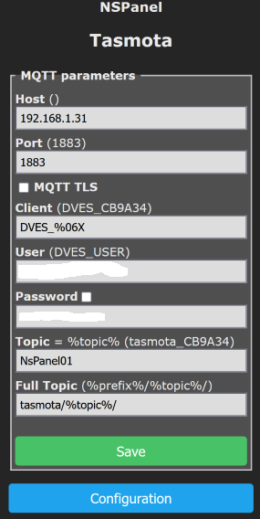

## Installation
**Preconditions**:
* Your NsPanel(s) are flashed with tasmota and lovelace ui
* [openHAB](https://www.openhab.org/) is installed and running
* You have an [MQTT Broker](https://mosquitto.org/), which is connected to openHAB and your NSPanel

**Installation Steps:**

### Step 1:
Clone this project with:
```
git clone https://github.com/olialb/nspanelMqttBridge
```
and go inside the project directory:
```
cd nspanelMqttBridge
```
### Step 2:
Call setup:
```
bash setup.sh
```

This installs the required python packages and configures a systemd service which is atomatically running the mqtt client after startup. The systemd service is started with the current user rights.

### Step 3:
Configure the ini file for your personal needs:
```
nano nsPanelMqttBridge.ini
```
Details of the configuration you can find in next section: [Configuration of ini file](#configuration-of-ini-file)

### Step 4:
Configure the pages (cards) and screen saver card of your panel in yaml files. How to do this is documented in section [Card file configuration](#Card-file-configuration). The example files in the *./config* folder should be enough to make some first tests.

### Step 5:
Test you configuration by starting the bridge from the command line. Go to the installation folder and enable the python environment with:
```bash
source venv/bin/activate
```
start the bridge:
```bash
python nspanel_mqtt_bridge.py
```
Check the logs carefully and fix all issues in your personal configuration before you go to step 6.

### Step 6:
Enabele the systemd service which was prepared in the setup script:
```bash
sudo systemctl enable nsPanelMqttBridge
```
and start the service:
```bash
sudo systemctl start nsPanelMqttBridge
```
Now the service is running in th back ground and the logs are stored in the configured log file location in case you want to check them. From now on systemd should start the bridge automatically after each reboot.

### Step 7
If you want to control the panel brightness and switch between cards over openHAB you need to add an MQTT thing to your openHAB thing configuration. As an example configuration, matching to the *nspanel01* default config after setup, it looks like this:

```javascript
//nspanel display
Thing topic nspanel01 "nspanel01" @ "Flur" {
    Channels:
        //Standard channels
        Type dimmer  : brightness       "display brightness"     [ stateTopic="nspanel-bridge/flur/brightness", commandTopic="nspanel-bridge/flur/brightness/set"]
        Type dimmer  : brightness_saver "Screensaver brightness" [ stateTopic="nspanel-bridge/flur/brightness_saver", commandTopic="nspanel-bridge/flur/brightness_saver/set"]
        Type number  : timeout          "Screensaver timeout"    [ stateTopic="nspanel-bridge/flur/timeout", commandTopic="nspanel-bridge/flur/timeout/set" ]
        Type string  : current_card     "Currend card"           [ stateTopic="nspanel-bridge/flur/card", commandTopic="nspanel-bridge/flur/card/set" ]
        Type switch  : status_left       "Status left"             [ stateTopic="nspanel-bridge/flur/status_left", commandTopic="nspanel-bridge/flur/status_left/set" ]
        Type switch  : status_right      "Satus right"            [ stateTopic="nspanel-bridge/flur/status_right", commandTopic="nspanel-bridge/flur/status_right/set" ]
        Type string  : notification     "Notification"           [ stateTopic="nspanel-bridge/flur/notfication", commandTopic="nspanel-bridge/flur/notfication/set" ]
        Type string  : version_hmi      "Version HMI"            [ stateTopic="nspanel-bridge/flur/version_hmi", transformationPattern="JSONPATH:$.hmi" ]
        Type string  : version_panel    "Version Panel"          [ stateTopic="nspanel-bridge/flur/version_panel", transformationPattern="JSONPATH:$.panel" ]
}
```
For more details about the topic structure and functionality behind see: [Exposed MQTT topics and usage](#exposed-mqtt-topics-and-usage)


## Configuration of ini file
In the project directory you find the configuration *mqtt-display-client.ini*. Adapt this file with an editor like *nano*:
```bash
nano nspanelMqttBridge.ini
```
The file has different sections. Most of the configuration you can keep untouched. The only thing which you need to adapt to your specific environment are:

* Host name or IP address and user name and password of your mqtt broker in section [[global]](#section-global)
* OpenHAB host name or ip address and api (if needed for your openHAB instance) in section [[oh]](#section-oh)
* The list of your NSPanels in section [[panels]](#section-panels)

All the other configuration settings you can keep untouched.

### Section **[global]**
This is the main configuration section.
* *broker=* Set here your mqtt broker address. Adapt the ip address or use url like *myLocalMQTTBroker.local*
* *port=* You can keep the standard port 1883 if you do not have a special setup
* *username=* Set here your user name for the broker. Keep it empty if no username is configured
* *password=* Password of your mqtt broker
* *topicRoot=* configuration of the root path of the published topics
* *reconnectDelay*= Retry delay in seconds if connection is lost to broker
* *publishDelay=* Publish cycle in seconds for topics
* *fullPublishCycle=* Publish cycle even if topic content is not changed. Cycle is *fullPublishCycle* multiplied with *publishCycle* in seconds
#nspanel command timeout. Time in seconds to wait until panel answers on commands witch "Done"
* *cmdTimeout=* NsPanel command timeout. Time in seconds to wait until panel answers on commands witch "Done"
* *screensaver=* brightness of the screensaver in %
* *standard=* standard brightness of the pages in %
* *saverTimeout=* screensaver timeout in seconds. 0 means no screensaver brighness change
* *saverUpdate=* sceensaver content update in minutes (to update the weather content). 0=Never

### Section **[logging]**
Configuration of the python logger which is used to log events

* *level*= configuration of the logging level (DEBUG, INFO, WARNING, ERROR, CRITICAL)
* *path=*" path to the log files
* *file=*" filename of the logger. If empty, logging in file is dispabled

### Section **[oh]**
Section to configure the connection to openHAB

* *host=* host name or IP address of your openHAB instance including http:// or https:// in front.
* *port*= port of the openHAB REST API. This is by default 8080 for http and 8443 for https in openHAB.
* *apiKey=* If your REST API access is restricted you can configure an apiKey. This is not needed in case you did not change the default configuration in openHAB
* "timeout=" Timeout for REST API calls. You can keep it untouched

### Section **[panels]**
This is the key section to configure the NSPanels at your home. Each line represent one panel. With the key before the '=' you configure the name of your panel in the [nspanelMqttBridge](https://github.com/olialb/nspanel-mqtt-bridge) and the string after the '=' represents the topic in of the panel which you configured in [tasmota](https://tasmota.github.io/docs/). In the examlpe configuration the panal is located in the room *Flur* and called like this room in the bridge. To this names you assign the each root MQTT topic of the panels:

* Format: *PanelName=RootTopic*
* Example: *Flur=tasmota/NsPanel01*

### Section **[configPath]**
This section defines the location of the card yaml files. This files define all the content in the panel.
By default the files are dynamically reloaded from this directory when they change. You can disable this feature by setting observer to disabled. When you do this, you need to restart the systemd process after each change in the yaml files.

* *cards=* Path to card yaml files. Default is a directory in the openHAB config folder /etc/openhab/nspanel_cards
* *observer=enabled*

All .yaml files in this location will be parsed and should contain card defintions. More details how to defines cards you can find in the section [Card configuration](#card-configuration). Subdirectories in this folder are ignored.

### Section **[localize]**
You can translate the content in the panel to different languages. This is done with the json file which is defined in the *localize* section. There are three language files predefined. More details in section [Translation](#translation)

* *lang=* lang/english.json
* *lang=* lang/english_US.json
* *lang=* lang/german.json

### Section **[skin]**
You can change some default colors and icons with the json file. More details in section [Skin](#skin)

* *skinFile=* skin/default_skin.json

## Card configuration
The following sections describe the yaml file format of cards. Cards are instances of the page types defined in [nspanel-lovelace-ui](https://github.com/joBr99/nspanel-lovelace-ui/blob/main/HMI/README.md).

All files with extention *.yaml* in the *config* folder defined in ini file section [[configpath]](#section-configpath) are loaded during startup. They must contain all cards which you want to show in your different NSPanles. Cards are instances of the different pages defined for [nspanel-lovelace-ui](https://github.com/joBr99/nspanel-lovelace-ui/blob/main/HMI/README.md).

### Example yaml files in config folder
After installation you find some example yaml files in the *config* folder:

| yaml file | Description
|--- |---
| home.yaml | Example configuration of some cards in group *home*. You can copy it to your config folder and adapt it to your needs according to next section.
| screensaver.yaml | Examples for a fully configured screensaver with weather forecast. You can copy it to your config folder and adapt it to your needs
| state_cards.yaml | Example file for a [stateCard](#status-slots-of-screensavers).  You can copy it to your config folder and adapt it to your needs.
|error_test.yaml| You can delete this file. Its a test file to test wrong card configuration.

### Card configuration format of yaml files

Cards are oganized in groups. The *home* group is the default group which is active after startup. You can also define other groups and navigate between them in the panel or with MQTT commands from openHAB. See section [navigation](#navigation)

Each yaml file must contain one or more card definitions. The file must start with:
```yaml
cards:
```
For each card you need to define the name, the type and other attributs:

| card attribute | default value | optional / Mandetory | Description |
|--- |--- |--- |---
| name |-|M| Unique card name. If you use the name of a panel for a card. This card will be shown first on that panel after leaving the screensaver! |
| type |-|M| The card type. All types and additonal specific attributes are listed in the next section |
| title | *name* will be used | O | Title which will be shown in the top of the card (if card supports it)|
| group | *home* | O |  Group name to organize cards in groups. Can also be a comma separted list of group names, in case the card should belong to more than one group |
| slots | - | M | List of slots. The slots are described in section [Card slots](#card-slots)  |

 The *slots* define the content of the *Fields* in the pages of the [nspanel-lovelace-ui](https://github.com/joBr99/nspanel-lovelace-ui/blob/main/HMI/README.md). There are different classes and types of slots available. Details are defined later. The main slot class is *ohItem*. This slot class reference an *item* of openHAB.

Let us define a simple example card based on [nspanel-lovelace-ui](https://github.com/joBr99/nspanel-lovelace-ui/blob/main/HMI/README.md) page type *cardEntities* with two slots:

```yaml
cards:
  - name: MyTestCard    #free name of the card
    title: Titletext    #test, which is shown as title of the card
    group: home         #card group where this card belongs to
    type: cardEntities  #type of the card
    slots:              #list of slots
      - class: ohItem
        text: Kugellampe            #Text shown in first field
        type: light                 #lovelace ui field type
        item: Switch_Kugellampe     #item in openHAB
      - class: ohItem
        text: Rollladen Wohnzimmer
        type: shutter
        item: Rollershutter_Wohnzimmer

```
This will end up in a card like this:

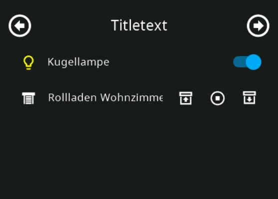

I think you see, that the card definition is straight forward, if you worked with yaml definition in openHAB Main UI.

#### Remarks to *name* and *group* of a cards
You must define a unique name for your card and and assign it to a group. This two attributes are used to navigate between cards (see [Navigation](#navigation)). You can define the names freely but there are special names reserved:

Reserved *group* names:

| Group name | Description
| ---       | ---
| *home*    | group *home* is the default group after startup. It will be used as default *home* group  for all panels
| *\_status_cards\_* | group *\_status_cards\_* contains all cards of type [statusCard](#status-slots-of-screensavers)
| *\_notify_cards\_* | group *\_notify_cards\_* contains all cards of type [popupNotify](#card-popup-notify)
| {*panelName*} | In case you give a group the name of a one of your panels, this group will be the home group for that panel.

Reserved *card* names:

| Card name | Description
| ---       | ---
| *.screensaver*    | card *.screensaver* is the default screensaver in grpup *home*. In case you do not define your own screensaver card, a default screensaver will be used. See also section [Card type *screensaver*](#card-type-screensaver)
| {*panelName*}.screensaver | In case you give a card the name of a panel with the extention *.screensaver*, this card will be the screensaver for that panel
| *\_default_status\_* | *\_default_status\_* is the default [statusCard](#status-slots-of-screensavers)


### Different *type*s of a card
The *type* attribute is the link to the page types in [nspanel-lovelace-ui](https://github.com/joBr99/nspanel-lovelace-ui/blob/main/HMI/README.md) but there are also specific types defined for this bridge. Here is a list of the supported types:

| Card type | max. number of slots in EU NSPanel | max. number of slots in US NSPanel |Description | Example |
| ---       | ---             |---          |--- |---|
| screensaver | 6             | 6             | Screen saver card with weather content. Details in section [Card type *screensaver*](#card-type-screensaver) | |
| screensaver2 | 14             | 14             | Screen saver card with extended weather content and 5 additional item status. Details in section [Card type *screensaver2*](#card-type-screensaver2) | |
| cardEntities | 4            | 6              | Card with the slots shown as a list. Details in section [Card type *cardEntities*](#card-type-cardentities-cardgrid-and-cardgrid2)| 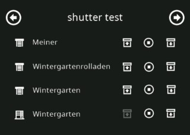 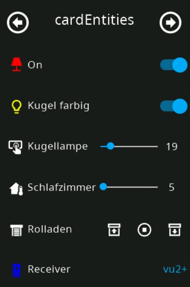 |
| cardGrid | 6             | 6             | Card with 6 slots as a 2x3 icon grid. Details in section [Card type *cardGrid*](#card-type-cardentities-cardgrid-and-cardgrid2) | 
| cardGrid2 | 8             | 8             | Card with 8 slots as a 2x4 icon grid. Details in section [Card type *cardGrid2*](#card-type-cardentities-cardgrid-and-cardgrid2) | 
| cardQR | 1             | 1             | Card to show QR code for a weblink . Details in section [Card type cardQR](#card-type-cardqr) | 
| cardQRWifi | 2            | 2              | Card to show QR code Wifi access . Details in section [Card type cardQRWifi](#card-type-cardqrwifi) | 
| cardAlarm | 5            | 5              | Card to show a Keypad to activate/deactivate alarm states. Details in section [Card type cardAlarm](#card-type-cardalarm) | 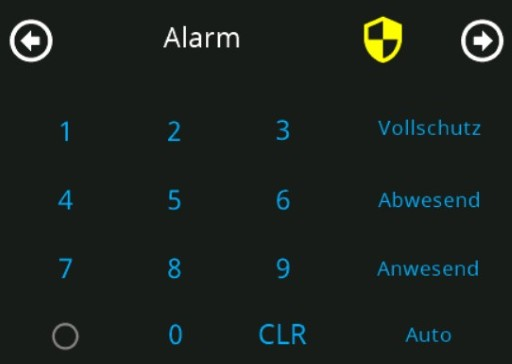
| cardThermo | 14             | 14             | Card to control a thermostat. Details in section [Card type cardThermo](#card-type-cardthermo) | 
| cardPower | 8             | 8             | Card show the power flow in your house. Details in section [Card type cardPower](#card-type-cardpower) | 
| cardChart | 1             | 1             | Card to show a chart based on the persistance data of an item. Details in section [Card type cardChard](#card-type-cardchart) | 

## Slot types and classes
### Slot class *ohItem*
The main slot class is *ohItem* which reference one or more items in openHAB and has different attributes depending on the slot type.
The following tables show the attributes which are in common for all slot types.

| Slot attribute | default value | optional / Mandetory | Description |
|--- |--- |--- |---
| type |-|M| The slot type itself. All type names and additonal specific attributes are listed in the next section |
| item | - | M | openHAB item name shown in the slot |
| text | openHAB item label | O | Text label shown for the item. If its not defined, the label of the openHAB item is used instead. For card type *CardGrid* it can be useful to show the item state instead of a text or item label. If you want this, set *text* attribute to *=itemState* |
| icon | default icon from skin.json | O | see how to [reference icons](#reference-icons-in-lovelace-ui)|
| iconColor | default icon color from skin.json | O | Icon color as web color name like "white", "yellow" or as 24Bit RGB value like #FFFFFF for white
| speed | 0 | O | controlls the animation speed for the slot (used in [card type cardPower](#card-type-cardPower)). Values between -120 and +120 are supported.
| options | options list from referenced openHAB item|O| Defines an options list loke in openHAB: TUNER=Radio,PHONO=Plattenspieler,AV2=vu2+ |

#### Reference icons in lovelace UI
Icons are encoded as unicode characters. You find all possible icon unicodes on the page [Material Icons](https://docs.nspanel.pky.eu/icon-cheatsheet.html). You can reference the icons in the yaml files over the unicode or the associated name in this page:

Examples:
```yaml
icon: ab-testing     #By name
icon: "\uE1C8"       #As character
icon: \ue1c8         #As hex value
```

### *ohItem* slot type *switch*
The *switch* type shows the state of the switch. By clicking on it, you can switch the state ON and OFF in openHAB. The iconColor can be automatically adapted depending on the switch state. default is "grey" for off and "yellow" for on This can be adapted with the attribute *iconStateColor*

| Slot attribute | default value | optional / Mandetory | Description |
|--- |--- |--- |---
| iconStateColor |*True*|O| If set to *True* color is set depending on the state. The colors for state ON and OFF are taken from skin file (yellow=ON, grey=OFF). Instead of true you can define different color values for ON and OFF. For example: *red\|white* or just *red* for ON. You can set this featere also to False. Than a static color is used.

Example 1:
```yaml
    ...
    slots:
      - class: ohItem
        type: switch
        text: =itemState
        item: Switch_Kugellampe
        icon: lamp
        iconStateColor: red|white   #state color definition
```

For example in *cardGrid*:

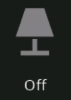

For example in *cardEntitie*:
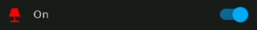

### *ohItem* slot type *light*
The 'light* type is the most complex type because its for lights with dimmer, color temperature and color functionality. Its based on the type *switch* and has the same attributs but extends it with additinal attributes:

| Slot attribute | default value | optional / Mandetory | Description |
|--- |--- |--- |---
| dimmerItem |-|O| openHAB Dimmer item to dim the light (inside the popUp)|
| colTempItem |-|O| openHAB Dimmer item to set the color temperature of the light (inside the popUp)|
| color |-|O| openHAB Color item to set the color of the light (inside the second popUp)|

Example:
```yaml
    ...
    slots:
      - class: ohItem
        type: light                 #lovelace ui field type
        text: Kugel farbig          #Text shown for the item
        iconStateColor: yellow|grey #state color definition
        item: Switch_Kugellampe     #Switch item in openHAB
        dimmerItem: Dimmer_Kugellampe        #openHAB item to control the brightness of the light
        colTempItem: Dimmer_Kugellampe_temp  #openHAB item to control the color temperature of the light
        colorItem: Color_Kugellampe          #openHAB item to control the color of the light
```
For example in *cardEntities*:


In *cardGrid*:


The type *light* looks in a *cardGrid* or *cardEntities* similar to the *switch* type but if you click on the text or icon a popUp opens and you can set dependent on the defined light items the full light functionality:

Example with brightness and color temperature:

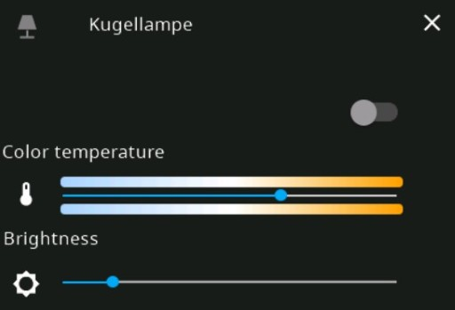

Example with color light and all other attributes:

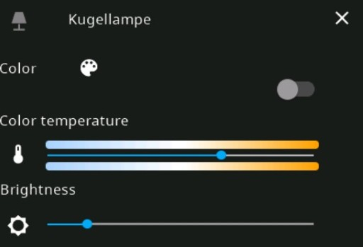

When you clik on the color palette icon a second popup opens:

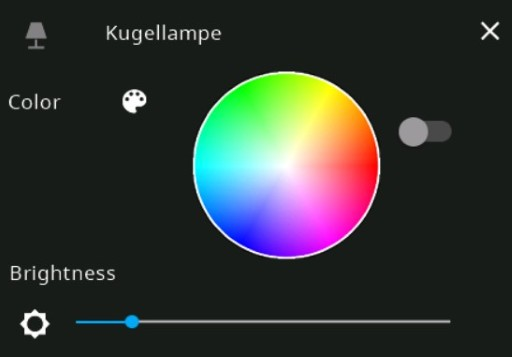

### *ohItem* slot type *number*
The *number* type shows the state of an openHAB Number item. It has in cardEntities a slider to set the value of the number in the range of the attributes min/max.

| Slot attribute | default value | optional / Mandetory | Description |
|--- |--- |--- |---
| min |*0*|O| minimal value of the Number|
| max |*100*|O| maximal value of the Number|

Example 1:
```yaml
    ...
    slots:
      - class: ohItem
        type: number                #lovelace ui field type
        text: Kugellampe            #Text shown in first field
        type: number                #lovelace ui field type
        item: Dimmer_Kugellampe     #a Dimmer item in openHAB
```
In *cardEntities*:
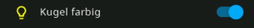

In *cardGrid*:
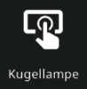

Example 2:
```yaml
    ...
    slots:
      - class: ohItem
        type: number                #lovelace ui field type
        text: =itemState            #show item state as text
        icon: home-thermometer
        item: H_Schlafzimmer_SetHeatTemp  #Number item in openHAB
```

In *cardGrid*:
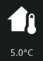

Example 3:
```yaml
    ...
    slots:
      - class: ohItem
        type: number                #lovelace ui field type
        text: Schlafzimmer
        icon: home-thermometer
        item: H_Schlafzimmer_SetHeatTemp  #Number item in openHAB
        min: 5                #min value of slider
        max: 30               #max value of slider
```
In *cardGrid*:
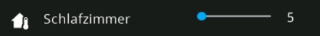


### *ohItem* slot type *shutter*
The *shutter* type shows the state of an openHAB Rollershutter item. By default it shows controls for UP/DOWN and STOP of the Rollershutter:

| Slot attribute | default value | optional / Mandetory | Description |
|--- |--- |--- |---
| shutterControls |*enable\|enable\|enable* |O| defines if the controls "UP\|STOP\|\DOWN" are enabled or disabled for the Rollershutter |
| tiltItem |disabled | O | Optional tilt Dimmer item for Blinds with tilt function |
| tiltControls |*enable\|enable\|enable* | O | defines if the controls "UP\|STOP\|\DOWN" are enabled or disabled for the tilt function of the shutter |

Example:
```yaml
    ...
    slots:
      - class: ohItem
        type: shutter                    #lovelace ui field type
        text: Rolladen                   #Text shown in first field
        item: Rollershutter_Wintergarten #Must be a Rollershutter item in openHAB!
        shutterControls: enable|enable|enable
        tiltItem: Rollershutter_Wintergarten_tilt
        tiltControls: enable|enable|enable
```
In *cardEntities*:
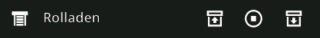

In *cardGrid*:
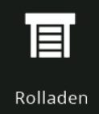

There is a popup card opening when you click on the item. You can also control which of the UP/DOWN/STOP controls are enabled:

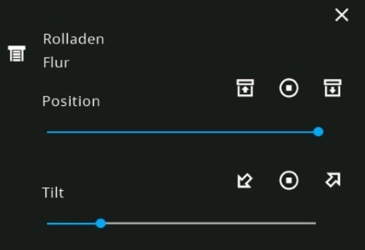

Same without tilt item:

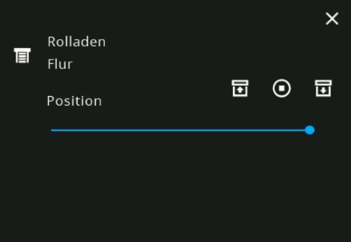

### *ohItem* slot type *input_sel*
The *input_sel* type shows the state of an openHAB item with different states. You can define a list of values which you want to select and toggle between them. The list is defined as a option list which maps the value of the item to names (like the options in openHAB):

| Slot attribute | default value | optional / Mandetory | Description |
|--- |--- |--- |---
|  | options list from referenced openHAB item|O| Defines the option list shown in the input selection popup |


```yaml
options: Name0=0,Name1=1,AND=2,SO=3,ON=4
```
 That means to use this type, your have to define a option attribute or reference an item which has an option list defined in openHAB:

Example:
```yaml
    ...
    slots:
      - class: ohItem
        type: input_sel           #lovelace ui field type
        text: Receiver            #Text shown in first field
        item: String_Yamaha_Input #openHAB String Item
        icon: remote-tv #remote icon
        iconColor: blue
        options: TUNER=Radio,PHONO=Plattenspieler,AV1=PS3,AV2=vu2+,AV3,AV4,AV5=Port 5,AV6=AV6,Bluetooth=Bluetooth,USB=USB,NET RADIO=NET RADIO,AUDIO1=Fernseher
```
In *cardEntities*:
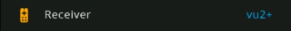

In *cardGrid*:
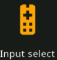

There is popup it you click on text or icon with the complte option list:

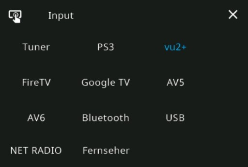

The Current state of the item is highlighted in a different color.

### *ohItem* slot type *text*
The *text* type shows the state of an openHAB item as text. The state **can not** be changed!!

Example:
```yaml
    ...
    slots:
      - class: ohItem
        type: text                #lovelace ui field type
        text: Receiver            #shown as text
        item: String_Yamaha_Input #openHAB String Item
        icon: \ueec4 #remote icon
        iconColor: orange
        options: TUNER=Radio,PHONO=Plattenspieler,AV2=vu2+
```
In *cardEntities*:
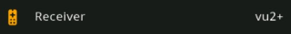

### *ohItem* slot type *button*
The *button* type shows the state of an openHAB item as text. You can toggle between the different states of the item in case its a switch (ON/OFF), an option list is defined as attribute or in the referenced openHAB item.

Example in *cardEntities*:
```yaml
    ...
    slots:
      - class: ohItem
        type: button              #lovelace ui field type
        text: Receiver            #shown as text
        item: String_Yamaha_Input #openHAB String Item
        icon: remote-tv
        iconColor: red
        options: TUNER=Radio,PHONO=Plattenspieler,AV2=vu2+
```
In *cardEntities*:


Example in *cardGrid* with state as text:
```yaml
    ...
    slots:
      - class: ohItem
        type: button              #lovelace ui field type
        text: =itemState          #Text shows the item state
        item: String_Yamaha_Input #openHAB String Item
        icon: \ueec4 #remote
        iconColor: red
        options: TUNER=Radio,PHONO=Plattenspieler,AV2=vu2+
```
In *cardGrid*:
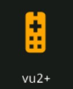

### *ohItem* slot type *openweathermap*
The *openweathermap* slot type is mainly meant to be used in the *screensaver* card. It shows a weather forcast based on the [*openwathermap*](https://next.openhab.org/addons/bindings/openweathermap/) binding in openHAB. Youn need an openHAB item for the channel *icon-id*, *time-stamp* and one item for the value which you want to see in the forcast (temperature, humidity, rain,...).

| Slot attribute | default value | optional / Mandetory | Description |
|--- |--- |--- |---
| item | - | M | the item attribute must reference with the openweathermap icon id for the forecast
| textItem | - | M | Item context will be shown as text. Can be an item with temperature, humidity etc.
| timeItem | - | M | OpenHAB *DateTime* item with the time of the forecast


Example:
```yaml
    ...
    slots:
      - class: ohItem
        type: openweathermap      #openweathermap forcast
        item: W_IconID_0          #item with weather icon-id
        textItem: W_Temperatur_0  #Forcast item, which you want to see in the forecast
        timeItem: W_Messung_0     #Timestamp of the forecast
```
In card *screensaver*:
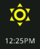

### Slot class *navigate*
The slot class navigate alows the navigation between cards and card groups. It use the following additional attributes:

| Slot attribute | default value | optional / Mandetory | Description |
|--- |--- |--- |---
| navTo | - | M | Navigation link. Can be: *cardName* of a card in same group or *groupName/cardName* to navigate to a card in another group or *groupName*/. to navigate to best matching card in a group (can be the first one or the one with panel name).

Example:
```yaml
    ...
    slots:
     - class: navigate
       text: Lampen  #Text shown for the link
       icon: menu-open #default icon for a nav slot
       iconColor: blue
       navTo: home/light    #Move tor card light in group home
 ```
In *cardEntities*:
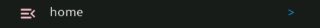

In *cardGrid*:
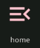

### Slot class *None*
The slot class *None* can be used to skip slots in the card and keep the slot empty. The slot class *None* has no attrubutes.

Examples:
```yaml
    ...
    slots:
     - class: None  #Skip this slot
     - class:       #Empty class name is equivalent to None. This slot is also skipped
 ```

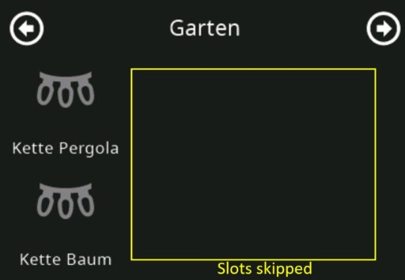

## Card types

### Card type *cardEntities*, *cardGrid* and *cardGrid2*
The card types *cardEntities*, *cardGrid* and *cardGrid2* are the main card types to show the state of *ohItems*. You can alos change the states of an item over them. All are configured in the same way.

*cardEntities* shows a list of maximal 4 slots:

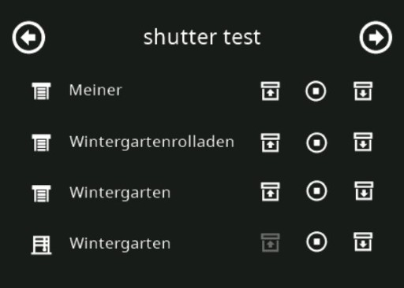

*cardGrid* shows a grid of 2x3 slots and *cardGrid2* a grid of 2x4 slots.

There is one additonal card attribute to control the size of the icons in grid cards:
| card attribute | default value from skin file | optional / Mandetory | Description |
|--- |--- |--- |---
|iconSize | large | O | icon size: *small*, *medium-no-icons*, *medium*, *large* (for the fonts 1,2,3,4 from here [UI fonts](https://github.com/joBr99/nspanel-lovelace-ui/wiki/cardgrid-entity-parameter#angaben-f%C3%BCr-label))

Example cardGrid:

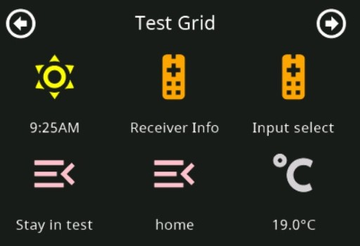

Example cardGrid2 with *medium* size icons:


### Card type *screensaver*
A *screensaver* card is active after a timeout which you can configure in the ini file. You can assign the default screensaver to a dedicated panel over the panel name with extention *.screensaver* (*name: panelname.scrennsaver*) Than this card will be used as *screensaver* card for the panel with name *panelname*

By default *screensaver* cards show only the current time and date. But you can define 1 slot which shows the current weather and 4 additional slots which shows a weather forecast for different times.

The currenty supported waether forecast is based on the [*openwathermap*](https://next.openhab.org/addons/bindings/openweathermap/) binding.

For this is a special slot type defined see [openweathermap slot type](#ohitem-slot-type-openweathermap).

You can also control all colors of the screensaver with the following card attributes:

| card attribute | default value from skin file | optional / Mandetory | Description |
|--- |--- |--- |---
|backgroundColor | #101010 | O | Background color
|tTimeColor 	| #FFFFFF | O | Color of the time
|timeAMPMColor |	#FFFFFF | O | Color of AM/PM in 12h time format
|tDateColor 	| #FFFFFF | O | Color of date string
|tMainTextColor| 	#FFFFFF | O | Color of current weather text
|tForecast1Color| 	#FFFFFF | O | Color of weather forcast 1 text
|tForecast2Color |	#FFFFFF | O | Color of weather forcast 2 text
|tForecast3Color 	| #FFFFFF | O | Color of weather forcast 3 text
|tForecast4Color 	| #FFFFFF | O | Color of weather forcast 4 text
|tForecast1ValColor| 	#FFFFFF | O | Color of weather forcast 1 value
|tForecast2ValColor	| #FFFFFF | O | Color of weather forcast 2 value
|tForecast3ValColor |	#FFFFFF | O | Color of weather forcast 3 value
|tForecast4ValColor |	#FFFFFF | O | Color of weather forcast 4 value
|barColor 	| #FFFFFF | O | Color of bar
|tMainTextAlt2Color| #FFFFFF | O | Color of alternative text
|tTimeAddColor| #FFFFFF | O | Color of time add

The *screensaver* card can have up to 6 slots

| Slot number | slot type| default value | optional / Mandetory | Description |
|--- |--- |--- |--- |---
| 1 | openwathermap |-| O | Current weather information
| 2-4 | openwathermap |-| O | 3 weather forcasts
| 5 | openwathermap |-| O | 4th weather forcast. Not visible if slot 6 is defined
| 6 | openwathermap |-| O | Alternative slot for wather forcasts


Example definition of a screensaver with *openweathermap* forecast:
```yaml
cards:
  - name: flur.screensaver #name of the nspanel where this screensacer should be shown + ".screensaver" suffix
    group: home
    type: screensaver
    backgroundColor: #0f0f0f
    barColor: blue
    slots:
      - class: ohItem               #current weather
        type: openweathermap
        item: W_IconID_0
        textItem: W_Temperatur_0
        timeItem: W_Messung_0
      - class: ohItem               #first weather forecast
        type: openweathermap
        item: W_IconID_6
        textItem: W_Temperatur_6
        timeItem: W_Messung_6
      - class: ohItem               #second weather forecast
        type: openweathermap
        item: W_IconID_9
        textItem: W_Temperatur_9
        timeItem: W_Messung_9
      - class: ohItem               #third weather forecast
        type: openweathermap
        item: W_IconID_15
        textItem: W_Temperatur_15
        timeItem: W_Messung_15
      - class: ohItem               #forth weather forecast
        type: openweathermap
        item: W_IconID_24
        textItem: W_Temperatur_24
        timeItem: W_Messung_24
```
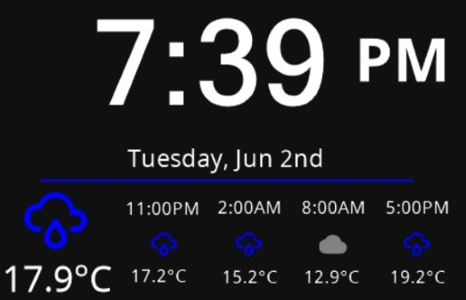

Example definition of a screensaver with alternative weather slot:
```yaml
cards:
  - name: .screensaver #default screensaver name for all panels
    group: test_saver
    type: screensaver
    backgroundColor: #0f0f0f
    barColor: yellow
    slots:
      - class: ohItem               #current weather
        type: openweathermap
        item: W_IconID_0
        textItem: W_Temperatur_0
        timeItem: W_Messung_0
      - class: ohItem               #first weather forecast
        type: openweathermap
        item: W_IconID_6
        textItem: W_Temperatur_6
        timeItem: W_Messung_6
      - class: ohItem               #second weather forecast
        type: openweathermap
        item: W_IconID_9
        textItem: W_Temperatur_9
        timeItem: W_Messung_9
      - class: ohItem               #third weather forecast
        type: openweathermap
        item: W_IconID_15
        textItem: W_Temperatur_15
        timeItem: W_Messung_15
      - class: ohItem               #Unused forecast slot
        type: openweathermap
        item: W_IconID_24
        textItem: W_Temperatur_24
        timeItem: W_Messung_24
      - class: ohItem               #Alternative forecast slot
        type: openweathermap
        item: W_IconID_24
        textItem: W_Temperatur_24
        timeItem: W_Messung_24
```
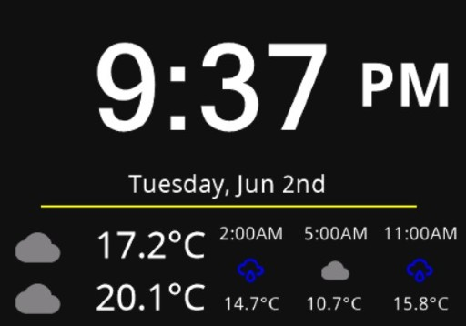


#### Additional remarks on screensavers and their names
If you do not define any screensaver in yaml files a default screensaver with name *.screensaver* is created in group *home*

If you define a screensaver card in a secific group this screensaver is shown after the screensaver timeout. If you do not define a sceensaver in a group. The bridge will move back to group *home* and the show the screensaver defined in home after screensaver timeout.

#### Status slots of screensavers

Each screensaver as two additinonal status slots on th upper left and right corner:

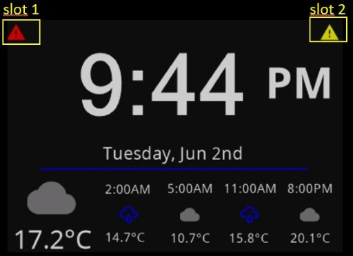

By default a red and yellow warning icon can be shown. You can switch them on and of by using the wwo MQTT topics [status_left](#status_left-switch) and [status_right](#status_right-switch)

You can also show the status of openHAB items in this two slots. For this you need to define a special card of type *statusCard*. The *statusCard* has one additonal card attribute:

There is one additonal card attribute to control the size of the icons in grid cards:
| card attribute | default value from skin file | optional / Mandetory | Description |
|--- |--- |--- |---
|iconSize | small | O | icon size: *small*, *medium* (for the fonts 1,3 from here [UI fonts](https://github.com/joBr99/nspanel-lovelace-ui/wiki/cardgrid-entity-parameter#angaben-f%C3%BCr-label))


```yaml
cards:
  - name: MyStateCard   #free name of the status card. Rename it to "_default_status_" to make this card the default state card
    type: statusCard
    slots: #2 slots must be defined in a statusCard
      - class: ohItem #left upper state slot
        text: =itemState #the state of the item will be shown as text after the icon
        type: light
        item: Switch_Kugellampe
      - class: ohItem #right upper state slot
        text: =itemState
        type: text
        iconColor: green
        icon: heat-wave
        item: H_Schlafzimmer_Temperatur
```
You can activate this card over an MQTT command to [status_card](#status_card-string) or you rename the card to *_default_status_* than your statusCard is active by default:

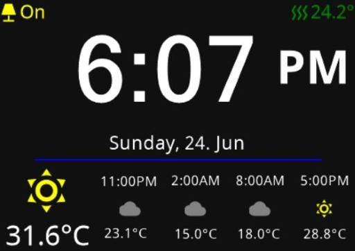


### Card type *screensaver2*
A *screensaver2* is similar to [sceensaver](#card-type-screensaver) but has more weather forcast slots and 6 item slots.

The *screensaver2* card can have up to 6 slots

| Slot number | slot type| default value | optional / Mandetory | Description |
|--- |--- |--- |--- |---
| 1 | openwathermap | empty | O | Current weather information
| 2-4 | openwathermap |empty| O | 3 weather forcasts for near future without time stamp
| 5-10 | openwathermap |empty| O | 6 weather forcasts with time stamp
| 11-15 | all status item types |empty| O | 5 slots with different openhab item status


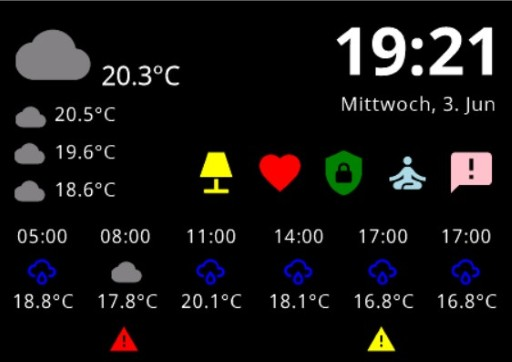


### Card type *cardQR*
The card type *cardQR* can for example be used to show a QR code with an html link as easy access to a local html server.

You need to define one slot with a reference to openHAB *String* items, which contains the link.

| Slot number | OH item type |slot type| default value | optional / Mandetory | Description |
|--- |--- |--- |--- |--- |---
| 1 |	String |text|-| M | String item with html link inside including *http://* or *https://*


Example openHAB items:
```javascript
//
// Links for QR Cards
//
String NsPanels_STRNG_Link_Mealie "Mealie Link"
```

Example:
```yaml
cards:
  - name: LinkMealie
    title: Mealie Link
    type: cardQR
    slots:
      - class: ohItem  #Slot with a reference to a string item for the QR code contents
        type: text
        text: "Mealie Link"
        item: NsPanels_STRNG_Link_Mealie
```


### Card type *cardQRWifi*
The card type *cardQRWifi* can be used to show a QR code to access a wifi. It has the following additional card attributes and two slots:

| card attribute | default value from skin file | optional / Mandetory | Description |
|--- |--- |--- |---
|security |	WPA2 | O | Security standard of the wifi ("WPA", "WPA2", "WPE" or "" for no unencrypted)
|	hidden | false | O | Define if wifi is hidden ("true" or "false")

| Slot number | OH item type |slot type| default value | optional / Mandetory | Description |
|--- |--- |--- |--- |--- |---
| 1 |	String |text|-| M | String item with Wifi ssid inside
|	2 | String | text |-| M | String item with Wifi password ssid inside

Slot 1 should contain the SSID of your Wifi network and Slot 2 the password.
Optional you can define in the Slots icon, iconColor and text attributes. If not default icons defined in the skin and the label from the openHAB items will be used

> **_NOTE:_** Out of this attributes will be a QR code with the following string content encoded: "WIFI:S:<SSID>;T:<WPA|WEP|>;P:<PASSWORD>;H:false;". For more details see for example here: [wiqrcode](https://wiqrcode.com/blog/complete-guide-to-wifi-qr-codes)

Example openHAB items:
```javascript
//
// Special QR card wifi items
//
String NsPanels_STRNG_SSID "Wifi Name"
String NsPanels_STRNG_Password "Password"
```

Example:
```yaml
cards:
  - name: guestWifi
    title: "Gäste Wifi"
    type: cardQRWifi
    slots:
      - class: ohItem   #SLot 1 with reference to openHAB String item with SSID
        type: text
        item: NsPanels_STRNG_SSID
      - class: ohItem   #Slot 2 with reference to openHAB String item with password
        type: text
        item: NsPanels_STRNG_Password
```


### Card type *cardAlarm*
The card type *cardAlarm* shows a keypad. You can use it to switch between different modes in your house pritected with a PIN.

You need to define 2 slots with a reference to string items in openHAB and 3 addtional optional slots. They are describes in the following table

| Slot number | OH item type |slot type| default value | optional / Mandetory | Description |
|--- |--- |--- |--- |--- |---
| 1 |	String |text|-| M | Ihis item will receive the key/PIN after entering in the keypad and pressing one of the buttons
|	2 | String with options defined| input_sel |-| M | This item defines the buttons shown on the right side of the card. Up to 4 buttons can be defined via options.
|	3 | String |text| icon and color from skin| O | This optional String item can be used to define the icon and the icon color shown on the top of the card. This icon can also flash. The String must have a specific format: *"{ON/OFF}\|{icon}\|{color}"*. Example *"ON\|\ue482\|red"* shows a flashing red security icon
|	4 | Switch |switch| enable | O | You can disable the complete keypad with this switch over openHAB
|	5 | Switch |switch| disable | O | On the right lower corner of the card can be an addtional icon placed to control an openHAB switch item

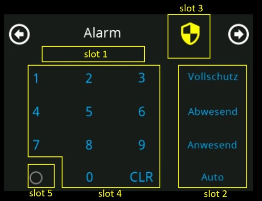

Example item configuration:
```javascript
// MQTT topic with active card
String NsPanel01CurrentCard "current card" { channel="mqtt:topic:mosquitto:nspanel01:current_card" }

//
// Special Alarm card items in openHAB
//
Switch NsPanels_SW_AlarmKeypadEnable "Enable Keypad"
String NsPanels_STRNG_AlarmMode "Alarm mode" {stateDescription=""[options="vollschutz=Vollschutz,abwesend=Abwesend,anwesend=Anwesend,auto=Auto"]}
String NsPanels_STRNG_AlarmKey "Key"
String NsPanels_STRNG_AlarmIcon "Icon"
```

Example card definition:
```yaml
cards:
  - name: Alarm
    title: Alarm
    type: cardAlarm
    slots:
      - class: ohItem
        type: text
        item: NsPanels_STRNG_AlarmKey
      - class: ohItem
        type: input_sel
        item: NsPanels_STRNG_AlarmMode
        #options: mode1="Vollschutz",mode2="Zuhause",mode3="Nacht",mode4="Besuch"
      - class: ohItem
        type: text
        item: NsPanels_STRNG_AlarmIcon
        icon: "\ue482"
        iconColor: "red"
      - class: ohItem
        type: switch
        item: NsPanels_SW_AlarmKeypadEnable
      - class: ohItem
        type: switch
        item: Switch_Kugellampe
#        icon: "\ue482"
#        iconColor: "red"
```


Example rule in openHAB for such a card:
```javascript
val String PIN = "0000" //Secret PIN to switch between the states

rule "nspanel alarm card"
	when Item NsPanels_STRNG_AlarmKey changed or
	Item NsPanels_STRNG_AlarmMode changed
then
	if( NsPanels_STRNG_AlarmKey.state == PIN) {
		if (NsPanels_STRNG_AlarmMode.state == "anwesend") {
            // do someting with this state

			sendCommand(NsPanels_STRNG_AlarmKey,"")
		} else {
			if (NsPanels_STRNG_AlarmMode.state == "abwesend") {
                // do someting with this state

				sendCommand(NsPanels_STRNG_AlarmKey,"")
			} else {
				if (NsPanels_STRNG_AlarmMode.state == "auto") {
                    // do someting with this state

					sendCommand(NsPanels_STRNG_AlarmKey,"")
				} else {
					if (NsPanels_STRNG_AlarmMode.state == "vollschutz") {
                        // do someting with this state

						sendCommand(NsPanels_STRNG_AlarmKey,"")
					}
				}
			}
		}
	}
  //decide how the icon should look like, depending on your state at home
  if (itemBlBla.state == "blablub") {
    sendCommand(NsPanels_STRNG_AlarmIcon, "ON|\uE482|yellow")
  }
end
```

### Card type *cardThermo*
The card type *cardThermo* can be used to control a thermostat at home

You need/can define the following card attributes and slots with references to items in openHAB:

| card attribute | default value from skin file | optional / Mandetory | Description |
|--- |--- |--- |---
| min |	5.0 ° | O | Minimum temperature which can be selected
| min |	30.0 ° | O | Maximum temperature which can be selected
|	steps | 0.5 ° | O | Steps for up and down
|	details | False | O | Activate popup card with 3 input_sel slots the slots 3-6. The fist 3 items with *type*: *input_sel* can be controlled over the popup card


| Slot number | OH item type |slot types| default value | optional / Mandetory | Description |
|--- |--- |--- |--- |--- |---
| 1 |	Number |number|-| M | Target themperature 1
| 2 |	Number | number |-| O | Target themperature 2. If this slot is set to None. The second themerature is not shown
| 3-6 |	any | text, input_sel|- | O | Shows the state of up to 4 items as text. If you enable
|	7-14 | Switch| switch |-| O | 8 different switch items which can be controlled over icons

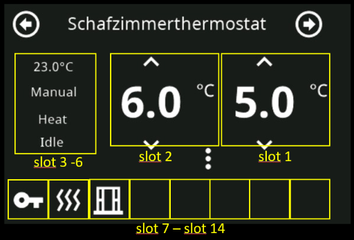

Item configuration for a Bosch Thermostat II used in this example:
```javascript
Group gThermostatSchlafzimmer "Schlafzimmerthermostat"  {ga="Thermostat" [ thermostatTemperatureRange="5,30" ], alexa="Thermostat"}
Number:Temperature H_Schlafzimmer_SetHeatTemp "Zieltemperatur [%.1f°C]" <temperature> (gThermostatSchlafzimmer) { ga="thermostatTemperatureSetpoint", alexa="TargetTemperature"}
Number:Temperature H_Schlafzimmer_Temperatur "Temperatur Schlafzimmer [%.1f°C]" <temperature> (gThermostatSchlafzimmer) { ga="thermostatTemperatureAmbient", alexa="CurrentTemperature"}
Number:Temperature H_Schlafzimmer_SetCoolTemp "Zieltemperatur [%.1f°C]" <temperature>
Switch H_Schlafzimmer_Lock "Lock"
Switch H_Schlafzimmer_boost "Boost"
Switch H_Schlafzimmer_windowOpen "Window Open"
String H_Schlafzimmer_OpMode "Thermostat Operation Mode" {stateDescription=""[options="manual=Manual,pause=Pause,schedule=Schedule"]}
String H_Schlafzimmer_SysMode "Thermostat System Mode" {stateDescription=""[options="off=Off,heat=Heat,cool=Cool"]}
String H_Schlafzimmer_RunState "Thermostat Running State" {stateDescription=""[options="idle=Idle,heat=Heat,cool=Cool"]}
```

Example card without cooling and popup:
```yaml
cards:
  - name: Thermo
    title: Schafzimmerthermostat
    type: cardThermo
    slots:
      - class: ohItem                     #Target temperature
        type: number
        item: H_Schlafzimmer_SetHeatTemp
      - class:                            #Cooling temperature slot is skipped!
      - class: ohItem                     #slot 3 shows current temperature as text
        type: text
        item: H_Schlafzimmer_Temperatur
      - class: ohItem                     #slot 4 shows current operation mode
        type: text
        item: H_Schlafzimmer_OpMode
      - class: ohItem                     #slot 5 shows current system mode
        type: text
        item: H_Schlafzimmer_SysMode
      - class: ohItem                     #slot 6 shows current running state
        type: text
        item: H_Schlafzimmer_RunState
      - class: ohItem                     #slot 7 shows icon with current lock state and can be touched and changed
        type: switch
        item: H_Schlafzimmer_Lock
        iconColor: "yellow"
        icon: key
      - class: ohItem                     #slot 8 shows icon with current boost state and can be touched and changed
        type: switch
        item: H_Schlafzimmer_boost
        iconColor: "red"
        icon: heat-wave
      - class: ohItem                     #slot 9 shows icon with current window open state and can be touched and changed
        type: switch
        item: H_Schlafzimmer_windowOpen
        iconColor: "yellow"
        icon: window-open-variant
```
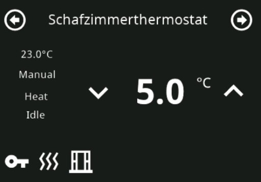

Example card with cooling, popup and all card attributes:
```yaml
  - name: ThermoExt
    title: Schafzimmerthermostat
    type: cardThermo
    min: 5.0
    max: 30.0
    steps: 0.5
    details: True
    slots:
      - class: ohItem
        type: number
        item: H_Schlafzimmer_SetHeatTemp
      - class: ohItem
        type: number
        item: H_Schlafzimmer_SetCoolTemp
      - class: ohItem
        type: text
        item: H_Schlafzimmer_Temperatur
      - class: ohItem
        type: input_sel
        item: H_Schlafzimmer_OpMode
      - class: ohItem
        type: input_sel
        item: H_Schlafzimmer_SysMode
      - class: ohItem
        type: input_sel
        item: H_Schlafzimmer_RunState
      - class: ohItem
        type: switch
        item: H_Schlafzimmer_Lock
        iconColor: "yellow"
        icon: "\uE305"
      - class: ohItem
        type: switch
        item: H_Schlafzimmer_boost
        iconColor: "red"
        icon: "\uFA44"
      - class: ohItem
        type: switch
        item: H_Schlafzimmer_windowOpen
        iconColor: "yellow"
        icon: "\uF1DB"
```
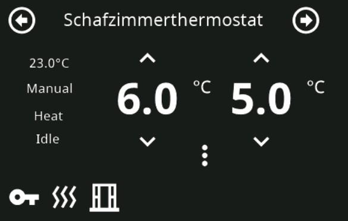

As you can see attribute *details: True*. The 3 dots can be clicked and a popup with the 3 input_sel items in slot 4-6 can be controlled over it:

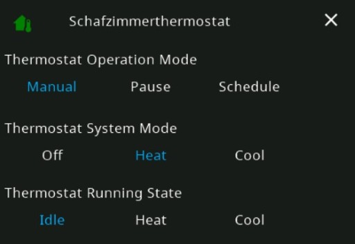

### Card type *cardPower*
The card type *cardPower* can be used to show your powerflow at home

The card has no extra card attributes. The slots are defined as following:


| Slot number | OH item type |slot types| default value | optional / Mandetory | Description |
|--- |--- |--- |--- |--- |---
| 1,2 |	Number |number|-| O | Power overview in home rectangle
| 3-8 |	Number | number |-| O | Different power sources or power consumers. Attribute *speed* can be used to control the animation speed

Example cardPower:
```yaml
cards:
  - name: TestPower #test cardPower
    title: Test cardPower
    type: cardPower
    slots:
      - class: ohItem
        type: number
        icon: home
        iconColor: green
        item: Power1
      - class: ohItem
        type: number
        item: Power2
      - class: ohItem
        type: number
        speed: -20
        text: Solar 1
        icon: solar-power-variant
        iconColor: yellow
        item: Power3
      - class: ohItem
        type: number
        text: Car port 1
        icon: car-electric
        iconColor: blue
        speed: 20
        item: Power4
      - class: ohItem
        type: number
        text: Car port 2
        icon: car-electric
        iconColor: blue
        speed: 100
        item: Power5
      - class: ohItem
        type: number
        text: Solar 2
        icon: solar-power-variant
        iconColor: yellow
        speed: 20
        item: Power6
      - class: ohItem
        type: number
        text: Car port 3
        icon: car-electric
        iconColor: blue
        speed: -50
        item: Power7
      - class: ohItem
        type: number
        text: Car port 4
        icon: car-electric
        iconColor: blue
        speed: -10
        item: Power8
```
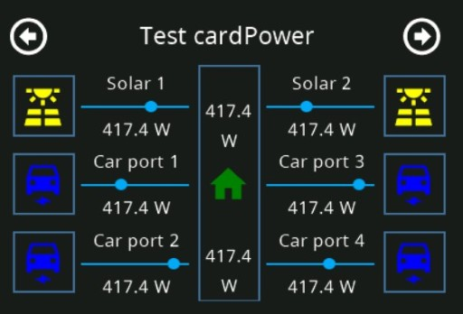

### Card type *cardCart*
The card type *cardCahrt* can be used to show a bar graph of the openHAB persistance data fo one item.

You can define the following card attributes and one slot with references to an items in openHAB:

| card attribute | default value | optional / Mandetory | Description |
|--- |--- |--- |---
| color |	violet  | O | color of the graph
| period | 60min | O | Periods in minutes which will be shown in the chart. You can also use keywords like: h, 2h, d, 3d, w, m, to define an hour, 2 hours a day, 3days, a week or a month. see also: [openHAB chart periods](https://www.openhab.org/docs/ui/components/oh-chart.html#period)
|	past | 0min | O | Minutes in the past from where the defined perios starts. You can also use keywords like: 2h, 2M etc. See [openHAB chart periods](https://www.openhab.org/docs/ui/components/oh-chart.html#period)
| life | False | O | When you set this attribute to True the cahrt is updated when the item change the state. Note: If the state is changes every few seconds this result in the sitation, that the screensaver is not activated.


| Slot number | OH item type |slot types| default value | optional / Mandetory | Description |
|--- |--- |--- |--- |--- |---
| 1 |	Number, Dimmer, Rollershutter |any|-| M | A char based on numbers will be genarated
| 1 |	String, Switch, Contact | any |-| M | A chart with a percentage of each state inside the defined period will be generated

Simple example for a number chart:

```yaml
  - name: PowerChart
    title: Stromverbrauch
    type: cardChart
    slots:
      - class: ohItem
        type: number
        item: Stromzaehler_power
```
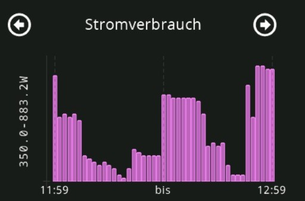

The y axis label is used to show the maximum and minimum values during the period. The minimum value in the chart is scaled that 0 on the y axis is equivalent to the minimum value in the defined period. The labels on the x axis show the start and end of the defined period. The date and time is formated dependant on the language you specified in the ini file.

Another example for a chart with the states of a *Switch* item:

```yaml
  - name: StateChart
    title: Küchenlicht
    type: cardChart
    period: d
    past: w
    color: yellow
    slots:
      - class: ohItem
        type: switch
        item: Switch_Kueche
```
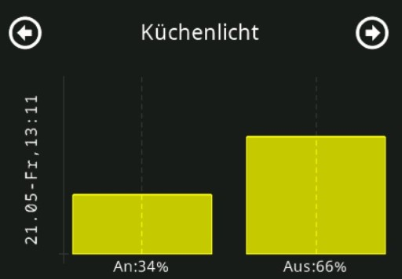

This example shows a yellow chart. You can see how long the kitchen light where active on the same day as today one week ago.

## Navigation between cards
This chapter describe the navigation concept between cards of the bridge. There are the following triggers how the bridge navigates between cards.

1. Click on left right icon in cards. This cycles between all cards of one group
2. Navigation slot. See [Slot class navigate](#slot-class-navigate).
3. Command over MQTT to topic card. See [card](#card-string).
4. Screensaver timeout

This together with the name rules cor cards, groups and panels allow a flexibel configuration of the card navigation for all connected panels to the bridge.

Let us look on a simple setup with two panels with names *a* and *b*.
The **[panels]** section in the ini file will look like this:

```ini
[panels]
a=tasmota/NsPanel01
b=tasmota/NsPanel02
```
### Navigation example one
Imagine you have the following requirements for your setup

1. Each panel should have its own screensaver:
    * Configure two *screensaver* cards with name "a.screensaver" and "b.screensaver" in your *home* group.
2. Each panel should have its own home card after leaving the screensaver:
   * Configure two cards with the panel names "a" and "b"
3.  Some specific items of your home you want to configure in a seperate group:
    * Configure an addtional group with an name like "more" with all the addtional configuration items in seperate cards
    * Configure a [*navigate*](#slot-class-navigate) link to this group in one of your card slots in group home.
    * The group *more* has no screensaver. That means the bridge will leave the group after the screensaver timeout and fall back to group *home*
4.  There should be a possibility to lock the panel when nobody is at home:
    *  Configure a group with name like *lock*.
    *  Configure a screensaver in the group lock that means the bridge will stay in this group after screensaver timeout.
    *  When openHAB detect absense, send a command to topic [card](#card-string) and switch to a card in group *lock*
    *  You need to activly move back to group *home* with a mqtt command to topic [card](#card-string) to leave the group lock.

Overview of this configuration:
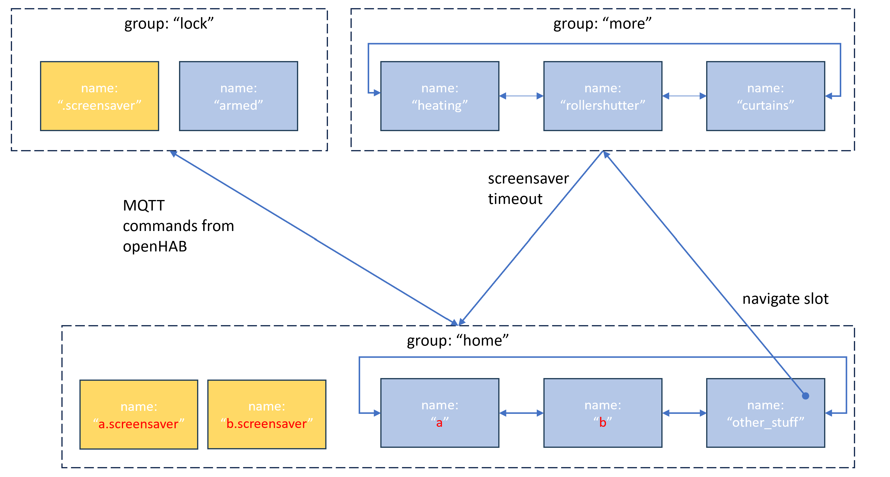

### Navigation example two
Imagine you have the following requirements for your setup

1. Each panel should have its own home card group:
    * Configure two card groups with the panel names "a" and "b"
    * Configure in card group "a" a *screensaver* card with name "a.screensaver" and card group "b" a screensaver card with name "b.screensaver".
2.  There should be a possibility to lock the panel when nobody is at home:
    *  You can use the unsused *home* group for this. When openHAB detect absense, send a command to topic [card](#card-string) and switch to a card in group *home*
    *  You need to activly move back to group *home* over a mqtt command to topic [card](#card-string) when someone is at home.

Overview of this configuration
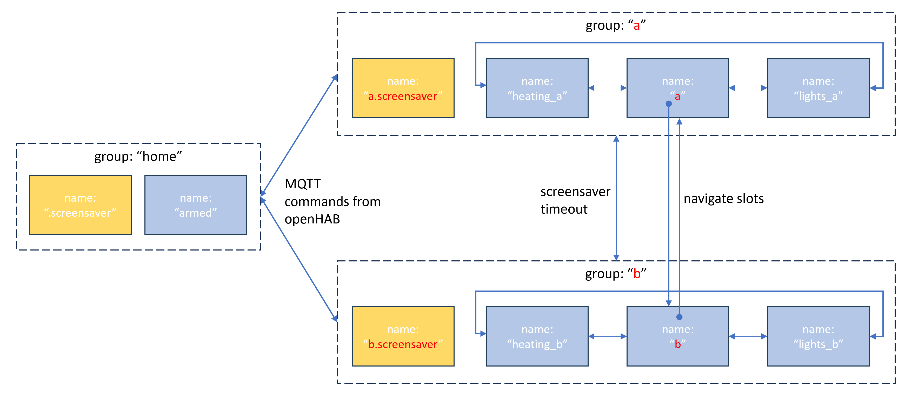

## Notifications
Addtional to the static cards you can also send notifications from openHAB to the panel

### Simple notification
You can send a notification text to the topic [notification](#notification-string). This text is shown in the *screensaver* and lost when you leave the screensaver

### Notification cards
For more persistant notifications you can define notification cards of type *popupNotify*. This cards show the content of an openHAB item as notification and can be activated and deactivated over an openHAB *Switch" item.

Card attributes of *popupNotify* card:

| card attribute | default value from skin file | optional / Mandetory | Description |
|--- |--- |--- |---
| title |	"Notification"  | O | Shown as title in the card
| fontSize | 2 | O | font size of the notification text. Values from 1-5 are allowd see also here [Label Parameter](https://github.com/joBr99/nspanel-lovelace-ui/wiki/cardgrid-entity-parameter#angaben-f%C3%BCr-label)
|	titleColor | white | O | Color of the *popupNotify* card title
| textColor | white | O | Color of the *popupNotify* card text
| b1Color | red | O | Color of the *popupNotify* card left button
| b2Color | green | O |Color of the *popupNotify* card right button
| b1Text | 'Ignore' |O  | Name of the left button. Default content depend on translation json.
| b2Text | 'OK' | O | Name of the right button. Default content depend on translation json.

Slots of *popupNotify* card:

| Slot number | OH item type |slot types| default value | optional / Mandetory | Description |
|--- |--- |--- |--- |--- |---
| 1 |	Switch | switch |-| M | The switch item in openHAB to activate and deactivate this notification.
| 2 |	Any | text   |-| M | Prefered to use a openHAB String item, which content is shown as notification text. You can add line brakes with "\r\n" in the string. As an alternative you can show any item state as text.
| 3 | String | text | n.a. | O | This is an optional openHAB *String* item. If its defined, the name of the button (b1Text or b2Text) is send to this item when the popupNotify is left. You can react on this in a special openHAB rule.

Notify card Example:

```yaml
  - name: PlantAlarm #free name of the state card.
    type: popupNotify
    fontSize: small
    title: Pflanzen giessen!
    slots: #2 slots must be defined in a notify popup
      - class: ohItem #switch to activate the notification
        type: switch
        item: Switch_PlantWarning
        icon: palm-tree
        iconColor: green
      - class: ohItem #Notification text
        type: text
        item: String_PlantWarning
```

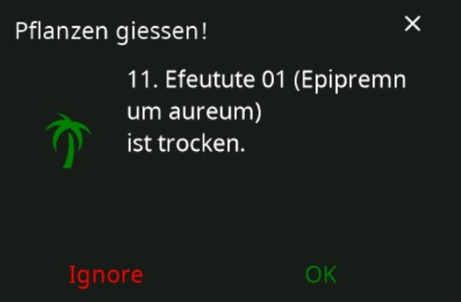

#### Behavior of a notification *popupNotify* card:
- When the switch item in first slot of the card is *ON*, a notification is shown in the screensaver and the card is shown first after leaving the screensaver
- You can press on the left button (default label "Ignore") to leave the card
- You can press on the right button (default label "OK) to leave the card and switch the item on slot 1 to *OFF*. That means you acknowledge the notification and switch it *OFF*. The notification card will not be shown again until the notifation text in slot 2 changes.
- As an alternative you can define a *String* item for slot 2 an react individually on the buttons. The state of the switch item in slot 1 is not touched by the bridge.

## Exposed MQTT topics and usage

The MQTT client is exposing the following topics. Note: *{rootTopic}* in this section must be replaced with the root topic defined in the [[global]](#section-global) section of the ini file. The *{panelName}* is taken from the [[panels]](#section-panels) section.

### brightness (numeric)
The current brightness of the display is exposed with the topic `{rootTopic}/{panelName}/brightness`. The value is a percentage value from 0 to 100. A new brigtness value can be set over the command topic `{rootTopic}/{panelName}/brightness/set` or over `{rootTopic}/brightness/set` to change the value in all connected panels.

### brightness_saver (numeric)
The current brightness of the display when the screensaver is active is exposed with the topic  `{rootTopic}/{panelName}/brightness_saver`. The value is a percentage value from 0 to 100. A new brigtness value for the screensaver can be set over the command topic `{rootTopic}/{panelName}/brightness_saver/set` or over `{rootTopic}/brightness_saver/set` to change the value in all connected panels.

### timeout (numeric)
The current timeout in seconds until the screensaver is activated is published in `{rootTopic}/{panelName}/timeout`. 0=no timeout. A new timeout value can be set over the command topic `{rootTopic}/{panelName}/timeout/set` or over `{rootTopic}/timeout/set` to change the value in all connected panels.

### card (string)
The current active card in the panel is published in format *groupName/cardName* over `{rootTopic}/{panelName}/card`. A new card value can be set over the command topic `{rootTopic}/{panelName}/card/set` or over `{rootTopic}/card/set` to change to the same card in all connected panels.. You can set the groupname and card name with the format *groupName/cardName* or just the card in current group with *cardName*

### status_left (switch)
Status of the left status slot in the screensaver (*ON/OFF*): `{rootTopic}/{panelName}/status_left`. The status can be set over `{rootTopic}/{panelName}/status_left/set` *ON* and *OFF* or over `{rootTopic}/status_left/set` to change the value in all connected panels.

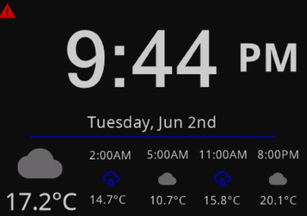

### status_right (switch)
Status of the right info status in the screensaver (*ON/OFF*): `{rootTopic}/{panelName}/status_right`. The status can be set over `{rootTopic}/{panelName}/status_right/set` *ON* and *OFF* or over `{rootTopic}/status_right/set` to change the value in all connected panels.

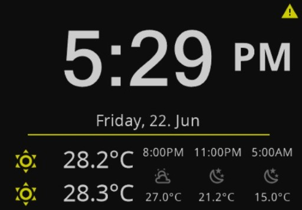

### status_card (string)
Shows the active status card for the status slots of the screensaver: `{rootTopic}/{panelName}/status_card`. The card can be set over `{rootTopic}/{panelName}/status_card/set` or over `{rootTopic}/status_right/set` to change the status card in all connected panels.


### notification (string)
You can send a string with a notification message while the screensaver is active. The message consist of a title and a text seperated by a '|'

Example notification: "Warning|Change battery in windows sensor bed room!"

Last value is published over `{rootTopic}/{panelName}/notification`. You can send a new notification to a specific panel: `{rootTopic}/{panelName}/notification/set` or to all connected panels: `{rootTopic}/notification/set`

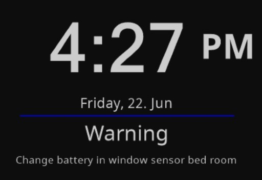

### version (json)
The panel type EU, US,... and the HMI version flashed in the panel are published in json format. The data is read only. Topic: `{rootTopic}/{panelName}/version`

## Skin
The skin file is located in folder *skin* and called *default_skin.json*. This setting can be changed in the ini file. The file is a json file and the content is more or less self explaing
## Translation
The translation file is located in folder *lang* and called *langunge.json*. The active language translation file can be changed in the ini file. The file is a json file and the content is more or less self explaining.

By default there is a *german.json*, *english.json* and *english_US.json* translation file.
