# NsPanel MQTT bridge

## Purpose of this project
This project provides a bridge to connect a NSPanel with [nspanel-lovelace-ui](https://github.com/jobr99/nspanel-lovelace-ui) to [openHAB](https://www.openhab.org/). It bridges the [nspanel-lovelace-ui](https://github.com/jobr99/nspanel-lovelace-ui) MQTT commands and messages to the [REST-API](https://www.openhab.org/docs/configuration/restdocs.html) of [openHAB](https://www.openhab.org/)

Note: As an alternative HMI you can also use also the HMI from this [fork ioBroker.nspanel-lovelace-ui](https://github.com/ticaki/ioBroker.nspanel-lovelace-ui/tree/main). The support is still experimental.

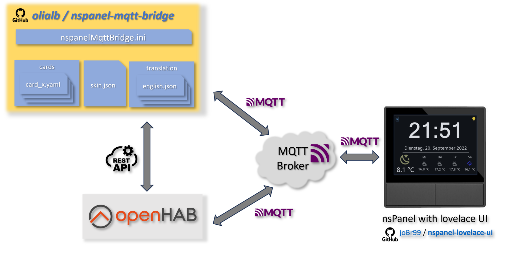

**Highlight features:**

* Full control of [openHAB](https://www.openhab.org/) Items over the [nspanel-lovelace-ui](https://github.com/jobr99/nspanel-lovelace-ui) in your NsPanel flashed with tasmota.
* Dynamic configuration of [nspanel-lovelace-ui](https://github.com/jobr99/nspanel-lovelace-ui) pages over yaml files.
* Support of multiple panels in different rooms with individual start pages and screensavers.
* Control the content of your panel with [openHAB](https://www.openhab.org/) rules (switch between cards, show warnings, lock the panel in your absense, set screen and screensaver brightness,...)

**Bonus features:**
* Translation of the UI elements in your prefered language with the translate.json file.
* Control of the overall look and feel with skin.json file. For example: Used standard icons, weather to icon mapping etc.

## Documentation
For more details, installation and configuration of the bridge have a look in the [wiki pages](https://github.com/olialb/nspanelMqttBridge/wiki)

## Screenshots

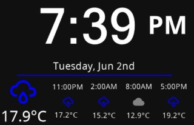

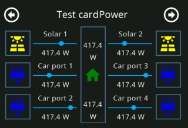
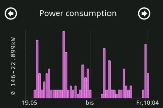
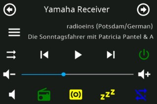
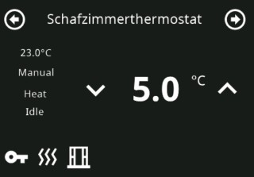
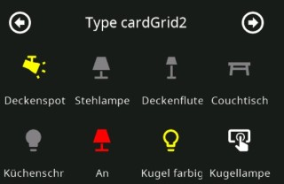
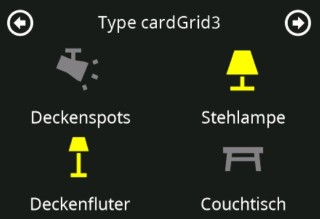
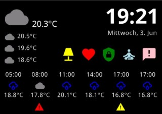

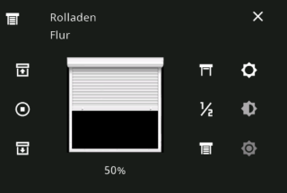
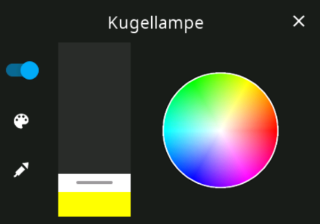
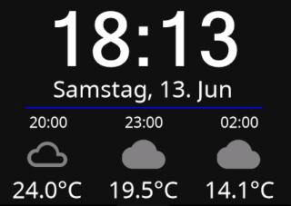
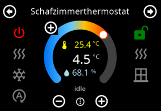

